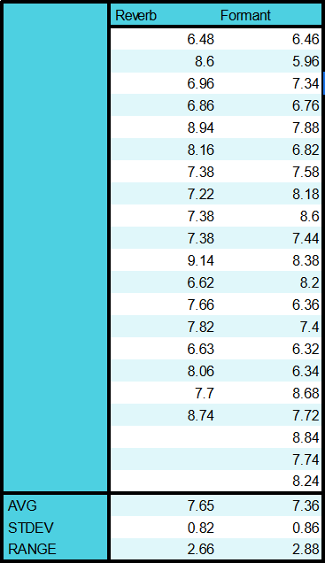

# EVImk5 Synth Response Times

This document is a record of testing the response times of the EVI. I will measure the response times of the analog interrupt circuitry, the digital interrupt based MIDI send, the digital synthesis, and the class D amplifier. I have read that the absolute limit of human hearing is delays of 3 milliseconds so my goal is to get the delay under 5 milliseconds between the the pressure crossing the threshold and the speaker playing sound. 

## Analog Interrupt circuitry

To test the analog interrupt circuitry I have hooked an oscope probe to directly to the output of the pressure sensor, and to the interrupt line for the breath control. I expect this to be on the order of nanoseconds since I am using a high response time LM393P comparator and a CD4043BE SR latch. 

|  |
|:--:|
| *A smooth attack shown with analog output and interrupt output. The Intterupt slope is many orders of magnitude smaller than the smooth attack* |

|  |
|:--:|
| *A sharp attack shown with analog output and interrupt output. The Interrupt slope is orders of magnitude larger than the attack.* |

As you can see in the above pictures the interrupt is orders of magnitude faster than my attcks are, so this delay is negligible. This allows us to just measure time in relation to the sharp peak of the interrupt which is good. 

## MIDI Delay

Now to measure the delay introduced by sending the MIDI data out of the system. I will hook up the probe to the interrupt signal and meaure the time till the start and the end of the first MIDI message out of the system. 

I was able to enable the Serial Decoder and was able to verify that 9 Bytes were sent in this time frame corresponding to the 3 MIDI messages I intended to send: note on, breath LSB and breath MSB. 

|  |
|:--:|
| *Cursor measuring the time until the start of the MIDI message from the rising edge of the interrupt. Includes the exact MIDI Bytes sent over serial. Time measured is 18.2 microseconds.* |

|  |
|:--:|
| *Cursor measuring the time until the start of the MIDI message from the rising edge of the interrupt. Includes the exact MIDI Bytes sent over serial. The time measured until the end of the MIDI messages is 107.2 microseconds.* |

I was able to get the MIDI message length so small since by setting the BAUD rate to 1,000,000 bits per second. I was able o do this since this MIDI line only goes directly between the teensy "brain" and the teensy "synth". Even when performing many trials the values did not change at this resolution so I can say with confidence the value will always be $18.2 \pm 0.2 \mu\text{s}$ and till the end of the MIDI message will be $ 107.2 \pm 0.2 \mu\text{s} $. 

## Digital Synthesis Delay

To perform this test most accurately I set the synthesizer to disregard breath data, and play a full volume saw wave as soon as the note on command is heard. I also add in a few effects for a second test to see how that might effect the response time. 

|  |
|:--:|
| *Measuring the Delay between interrupt and the synthesis of notes. This had a large variation and I obtained a value of $ 7.6 \pm 0.8 \text{ms} $* |

|  |
|:--:|
| *Raw data from testing the delay of note syntheis. Both with and without effects were indistinguishable.* |

With and without effects I was very well within 1/5 of a standard deviation of each other so I conclude that the number of effects has no effect on the delay to sound synthesis. I also noticed the range of data taken was $ 2.9 \text{ms} $ for both which is exactly the block delay from one audio sample bloack of 128 values at 44.1kHz which is what I am using, which leads me to conclude that that starting the note at different times within the audio blok is causing the variation. Since the sample rate never dipped below 5.8ms I also want to conclude that It took there were 2 audio block delays from first detecting note on for the system to start playing the note. 

## I2S Delay

I also tried detecting just the delay to the I2S line before sound synthesis but that is constantly outputting data so I could not easily when that started sending data to turn on the note. 

## Conclusion 

My delay is longer than I had hoped for by up to 40%, but it is still indistiguishable to my ear so that is good enough for now. In order to get better delay it seems as if I will need to decrease the audio block size. I predict that a block size of 64 instead of 128 will have delays of 3ms to 4.5ms which gets me within my target delay range if possible. 

## Addendum 

I have neglected one very important factor in this analysis, the fact that sound is not instantaneously produced by a trumpet. According to Wikipedia trumpet page the sound in a trumpet is produced by a standing wave produced in the the resonance cavity of the trumpets tubing, which means that for sound to start being produced the wave starting at your lips buzzing must at least travel to the bell of the instrument. This wave can only travel at the speed of sound though which is relatively slow. A trumpets tubing is approximately 1.48m long, and the speed of sound is roughly 343m/s. This together would give a delay of 4.3 milliseconds between buzzing and sound production from the bell of the instrument, the analog of the speaker of the EVI. This brings our 6-9 millisecond delay within 5 milliseconds of a trumpets delay. So I am happy with the delay of my EVI so far. It would be nice to get decrease the block size in the synthesizer to see what happens but that seems to be a major endeaver so for now I am satisfyed. (3/17/24)
